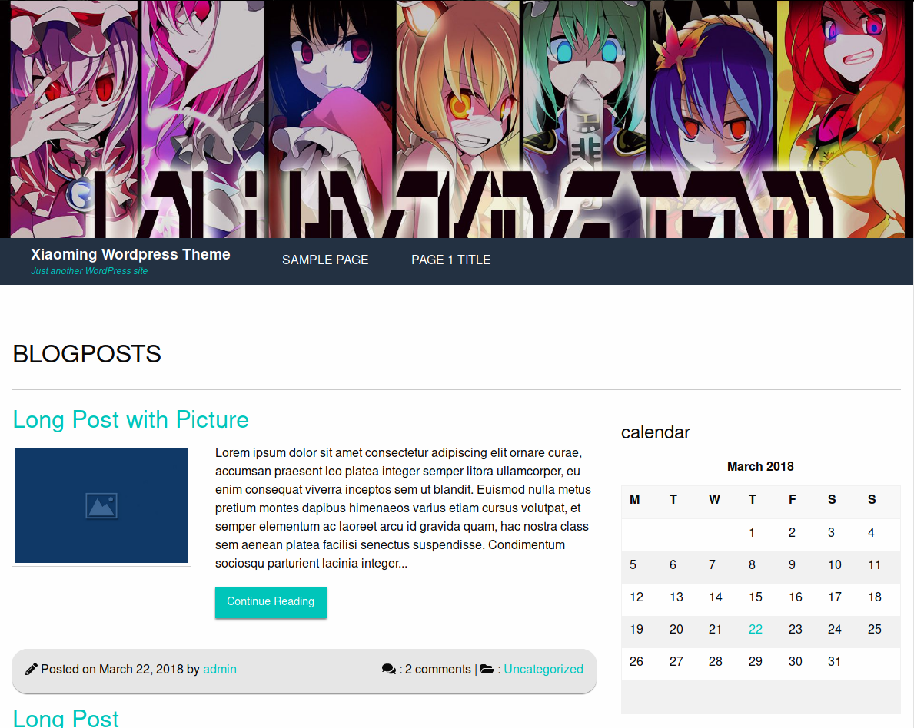

# Wordpress Themes by XiaoMing

This is a theme pack of custom themes developed by me.

## List of Themes
* [Themeone](./themes/themeone)
  
  
  A simple Wordpress themes developed using the Foundation 6 by Zurb.
  So far not that complicated and lacks some customization features.
  
## Development

It is recommended to use docker to setup a runtime environment for this project.
This repo provides a docker-compose.yml file and that is convenient for setting up a development environment. 
To test your changes, all you have to do is stand in  the project root, and than run
```
$ docker-compose up -d
```
Than open up your web browser than go to `localhost:8000`
Note that some features like uploading, and cropping aren't working as expected in the docker environment.
The database is seeded using the wordpress.sql database file.

### Login in wp-admin
Username: `admin`
Password: `password`

More themes are comming soon
